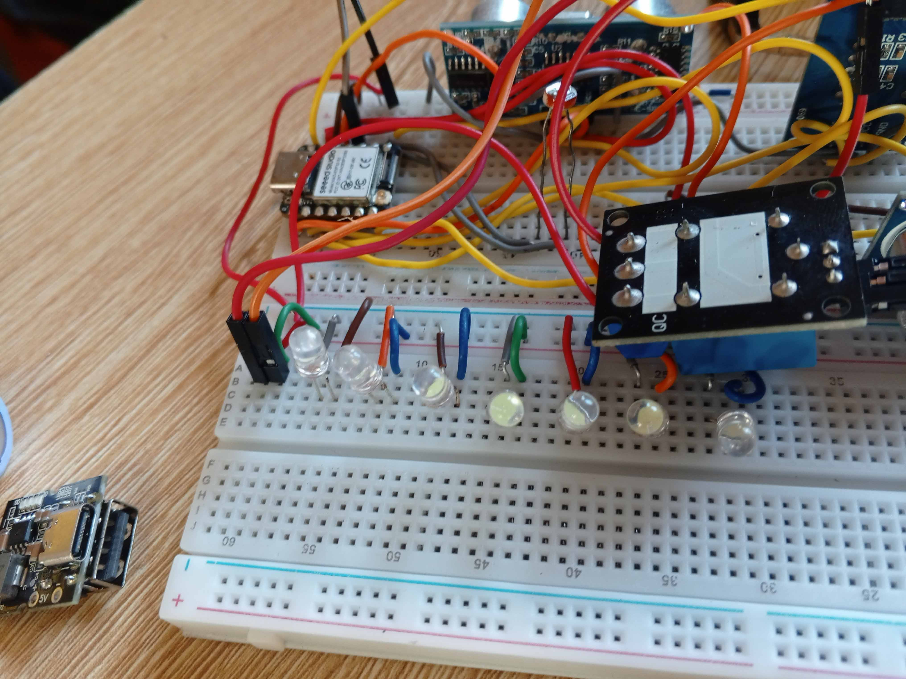

# Journal — Lundi 14 SEPTEMBRE 2026 (rédigé par : ADOUFA Koffi Eben-Ezer) #
Atelier : MAQUETTE PÉDAGOGIQUE D’UN ÉTABLISSEMENT SCOLAIRE INTELLIGENT
Comme proposé le samedi lors du constat fait concernant les composants, nous avons décidé de changer de projet. Le projet adopté, selon le matériel présent, est une maquette pédagogique d'un établissement scolaire intelligent : un système de gestion intelligente de l’éclairage et du parking scolaire. Ce projet consiste à concevoir une maquette en trois dimensions représentant une école. La particularité de ce projet est que nous allons simuler l'éclairage de l'établissement à la tombée de la nuit avec des ampoules équipées de LDR (photorésistances), ainsi que compter le nombre de véhicules entrant ou sortant du parking de l'établissement.

Activités
Les activités réalisées au cours de la journée sont la modélisation de la maquette dans Fusion 360 et le test de chaque composant pour constater son état et son fonctionnement.

Rédaction du code en MicroPython afin de tester l'assemblage et de simuler son fonctionnement.
Voici quelques images de la maquette réalisée sous Fusion 360 en 3D :

Maquette en 3D vue isometrique

Maquette en 3D vue de dessus

Voici quelques images prises lors de l'essai sur la plaquette breadboard.

Le breadboard avec les composants montés, sans éclairage en raison de la présence de lumière

Ici, le montage est allumé, car la LDR a été mise totalement dans l'obscuri
Pour la partie concernant le comptage des engins présents dans le parking, nous avons utilisé un capteur à ultrasons à l'entrée et à la sortie du parking. Avec un afficheur, nous pouvons connaître le nombre de véhicules présents sur le parking.

Voici l'afficheur avec un nombre incrémenté à l'écran, représentant le nombre de véhicules dans le parking

Appris
Comment réaliser un projet avec les composants disponibles sans dépendre de ceux qui manquent.
Comment fonctionnent les éclairages publics avec des lampadaires qui, à la tombée de la nuit, s'allument automatiquement.
Raté, puis corrigé
Au début, nous avions choisi un projet, mais, faute de composants, nous en avons choisi un autre en tenant compte des composants disponibles, grâce aux conseils des encadrants, notamment Monsieur Magloire et Emmanuel.
Nous avons ensuite choisi un projet qui consistait à simuler l'éclairage d'une cité et la gestion de son parking. Comme il était très important de choisir un projet académique ou didactique, nous l'avons modifié pour gérer l'éclairage et le parking d'un établissement scolaire.
Décidé
Réaliser dans un premier temps la maquette 3D sous Fusion 360, puis réaliser le schéma sur breadboard et lancer la simulation.
À faire demain
Commencer la découpe au laser de la maquette.
Continuer à améliorer le circuit en ajoutant l'alimentation et le relais pour les LED.